# FPGA-SHA256

> 2022 Spring NCKU FPGA Course
>
> Final Project
>
> E24076239 E24076297 E24076750

## Introduction to SHA-256

### What is SHA-256?

- Cryptographic hash function
- SHA-2 Family
  - Proposed by US NIST in 2001
  - SHA-224, SHA-256, SHA-384, SHA-512
  - Evolved from SHA-1 family, which has collisions found
- Avalanche Effect
  - A tiny change of the input data (flip a bit), every bit of the output would have a chance of 50% to flip

### Application of SHA-256

- Help proof the integrity of data
  - Password hashing
  - Communication protocols, TLS, SSL, SSH, etc.
- Crypto mining - Proof-of-Work (PoW)
  - Given a hash function h, find the attribute of h(n) for a given input n
  - For example:
    - Find h(n) that has consecutive 16 bits of 0 at the beginning of the result
  - Requires lots of hashing calculation

### Algorithm

- Data Preprocess
  - Pad a single bit 1 to the end of the data
  - Pad zeroes until the data length % 512 = 448
  - Add the original data length with 64-bit at the end of data
- The output data length will be multiple of 512 bits

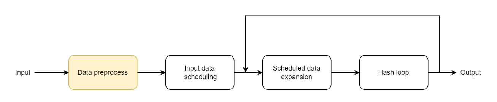

- Input data scheduling
  - Divide the preprocessed data by 512-bit
  - Send the divided data to the main hashing functions one by one

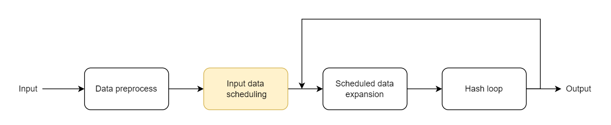

- Scheduled data expansion
  - Separate the input 512-bit data by 32 bits to form w[0] to w[15]
  - Expand w[16] to w[63] with the following algorithm:

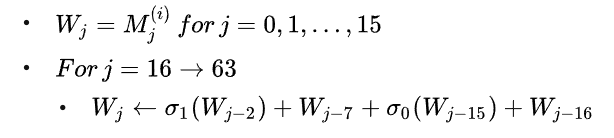

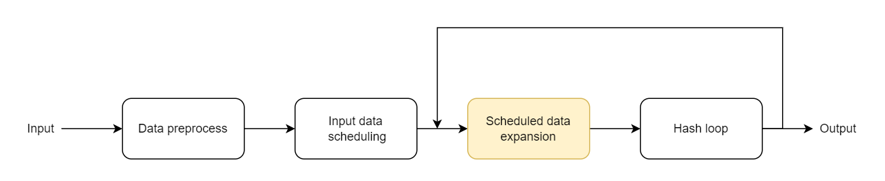

- Main hashing loop
  - a – h were initialized with some initial value (h0 – h7)
  - For each w do the algorithm shown on the right
  - Results of a – h will be added to the h0 – h7 as the next round initial value

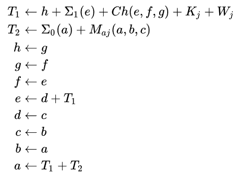

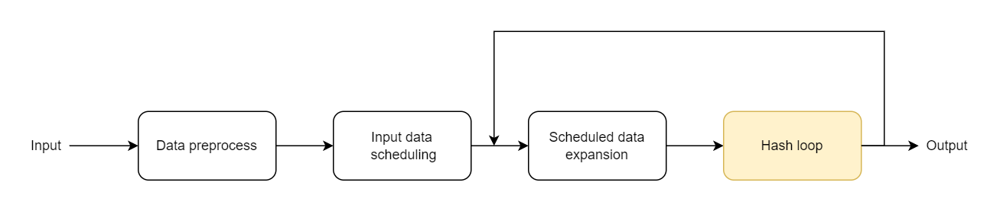

## Architecture Design

### Work Partition

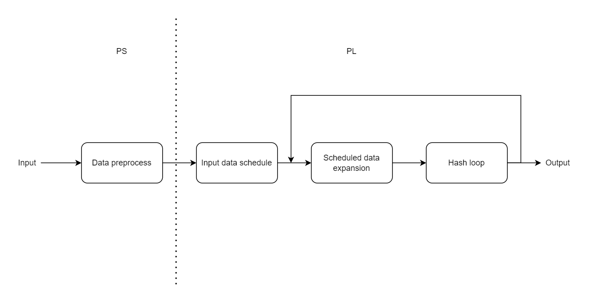

### System Architecture

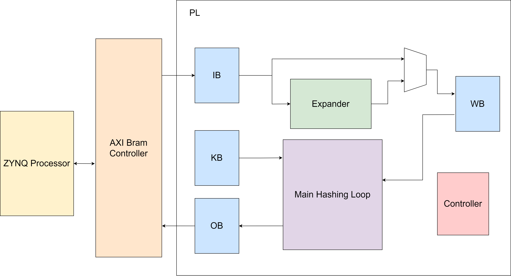

### Scheduled Data Expansion

- The data expansion can be represented in the data flow graph

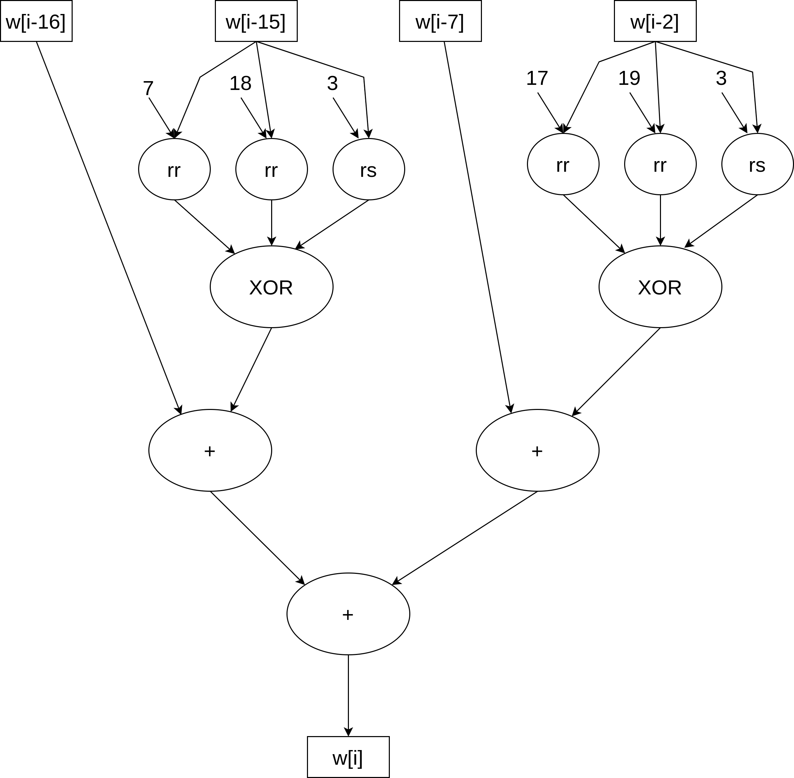

#### Scheduled Data Expansion – Original Version

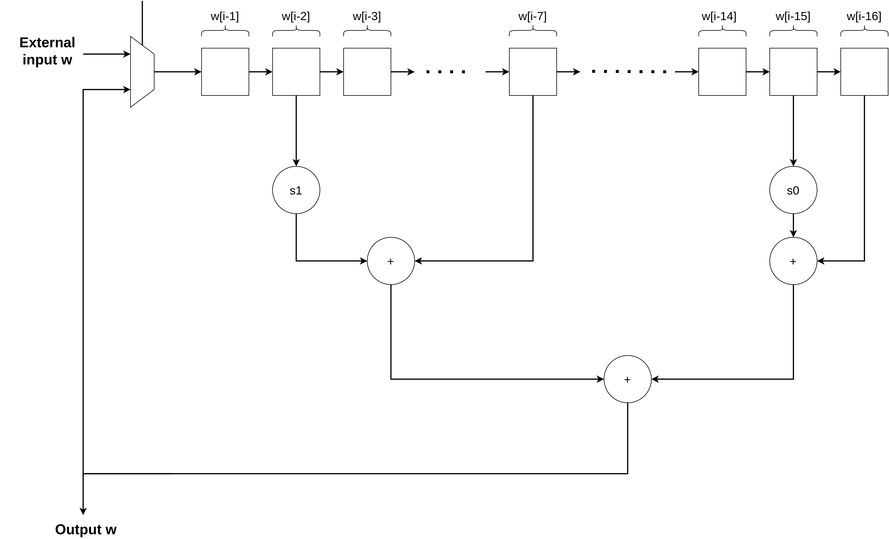

### Main Hashing Loop

- On the end of an iteration :
  - a and e get new values
  - b, c, d, f, g, and h get the value from their previous letter:
    - b' <= a
    - c' <= b
    - d' <= c
    - f' <= e
    - g' <= f
    - h' <= g
  - w and k are updated with the next input values

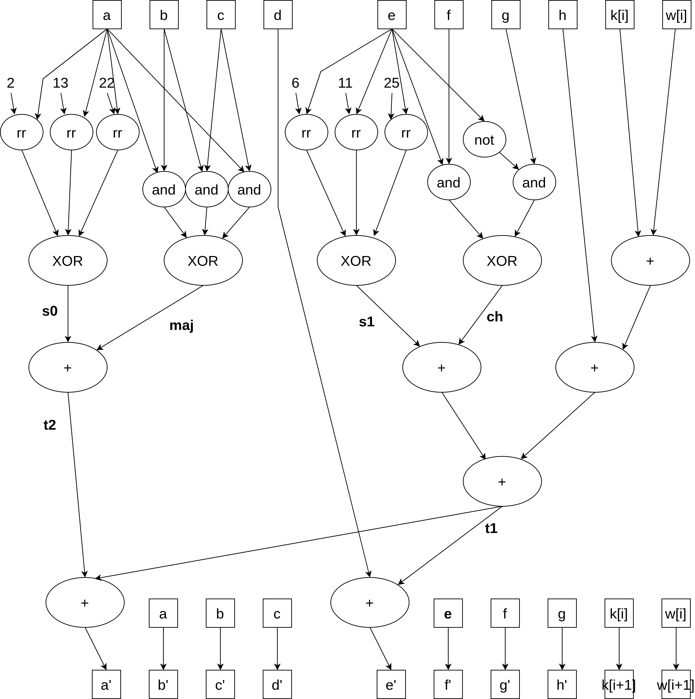

#### Original Version

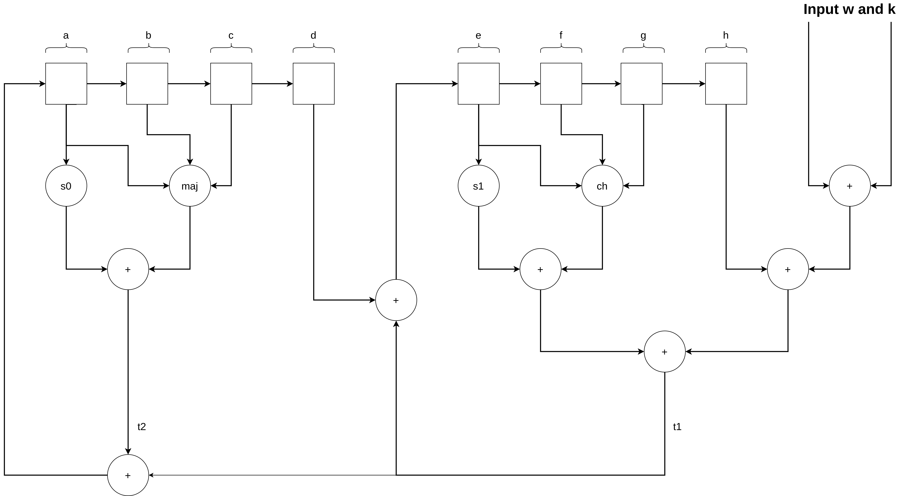

#### Critical Path

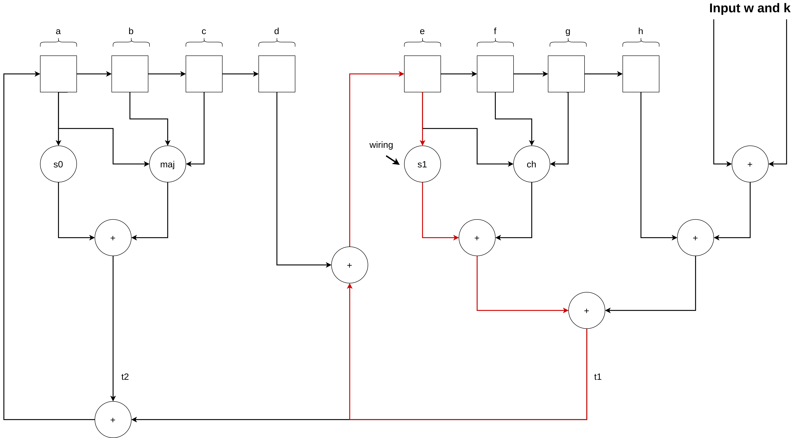

#### Problem Discussion

- There exists data dependency with each iteration so we cannot gain benefit from loop unrolling
- Pipeline has the same problem of the data dependency
- However, we can use pipeline interleaving to improve performance by increasing throughput

#### Divide into 4 Stages

- The critical paths are a and e, the two datapaths can be divided into 4 stages
- We can apply the pipeline interleaving strategy on this graph, processing 4 different inputs
- 4 cycles are needed for an input to finish one iteration, which means its a-h are updated every 4 cycles

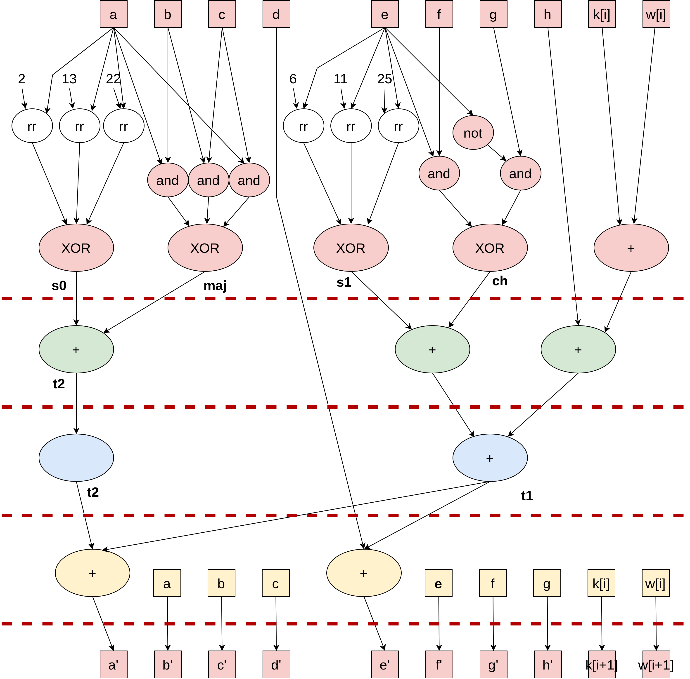

### Main Hashing Loop: Modified Version

- Using FIFOs to store the a-h values for each input, the a-d and e-h FIFOs are cascaded respectively
- On each 4 cycles
  - The new a and e are fed into the head of FIFOs
  - For b, c, d, f, g, and h, each of them receives the value from its previous FIFO

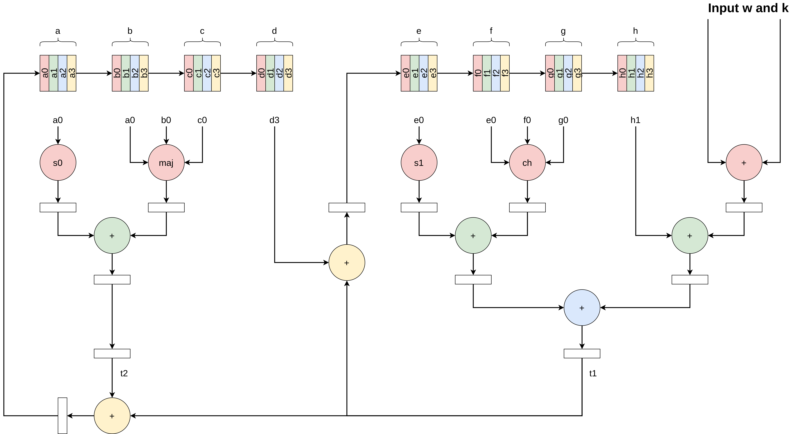

### Scheduled Data Expansion – Modified version

- For every 4 cycles, a new w[i] is generated, and each w[i-n] in FIFOs are shifted to w[i-n-1] (except w[i-16])
- For an input data, the first 16 selected inputs w(w[0]-w[15]) are from BRAM, while the expansion circuit generates the following w (after w[16])

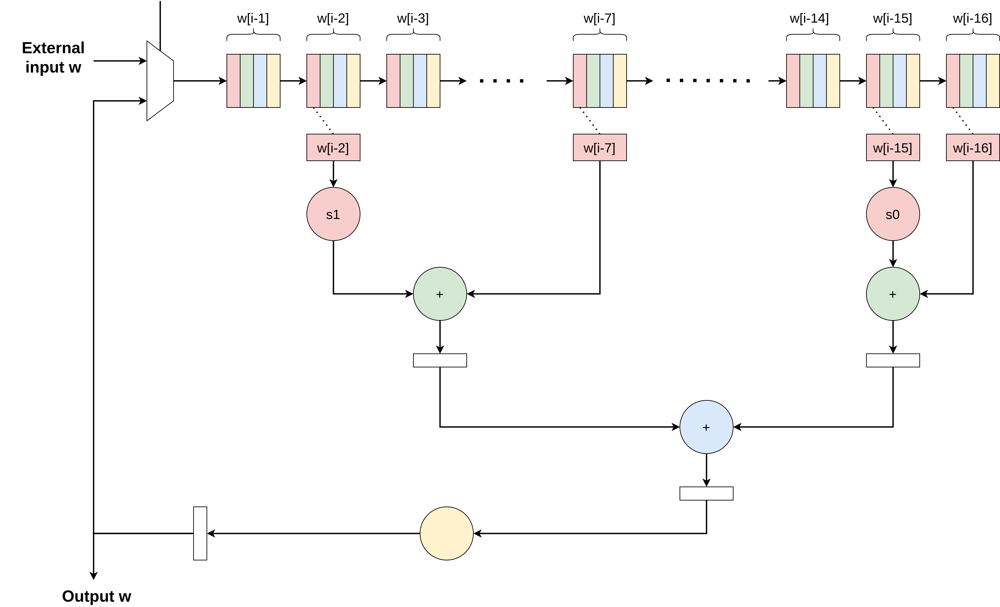

### 4-Input System Architecture

- Maximum input size: 4KB

- Each input were written to an IB with its preprocessed data 

- Allows 4 hashing calculation concurrently

- Outputs are written to OB with specific base address

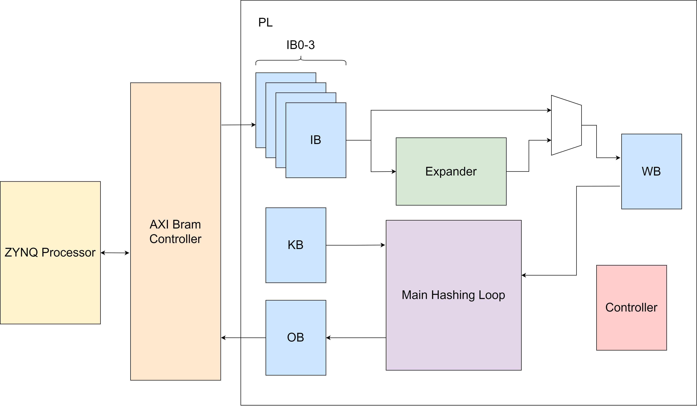

### Execution of Expander & Main Loop

- The expander and main hashing loop can calculate concurrently
  - Same pipeline stages
  - The first 16 inputs are independent of the result of expander

## Communication between PS & PL

### Sending Input Data

- PS will check which bank of BRAM is already calculated and write the new input data to the BRAM
- Write data through AXI BRAM Controller
- It takes about 0.067 seconds for PS to write a 4KB data

### Polling

- PS sends the size of preprocessed data and start signal to PL
- After PL recevied start signal, start to compute hash value
- Once the work is done, PL sends valid to PS then PS return clear to PL

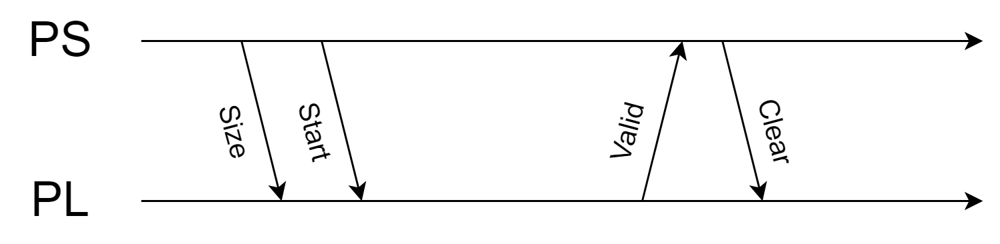

### How to do better? - Interrupt

- Register interrupt service routine for interrupt signal on the CPU program (Python)
- Prevent from occupying CPU resources when doing busy waiting for valid signal
- Not implemented on our system yet

## Results

### Block Design

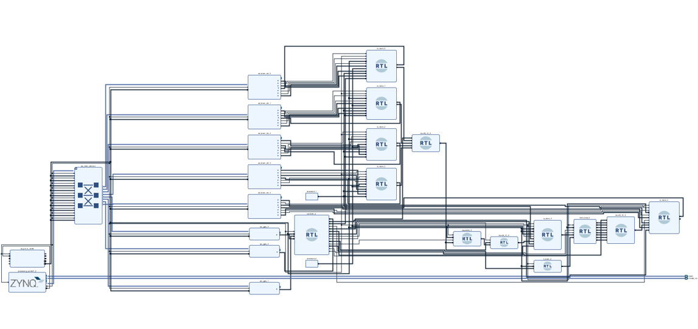

### Synthesis & Implementation Results

- Used BRAM: 7
- Used LUT: 2416

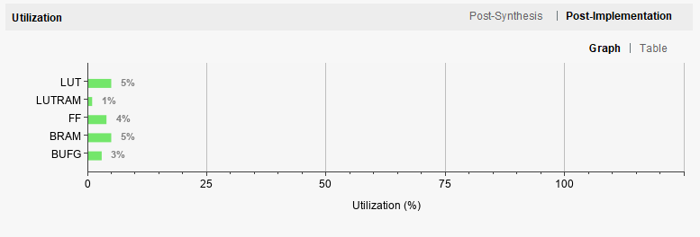

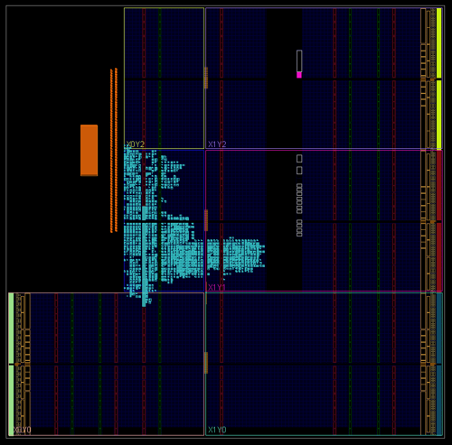

### Performance

| FPGA                                | Python                            |
| ----------------------------------- | --------------------------------- |
| 0.02 second for an input on average | 2 seconds for an input on average |
|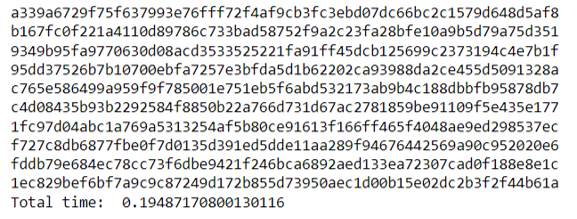 |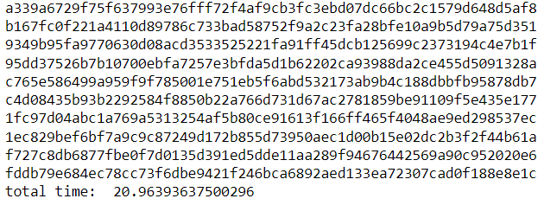 |
